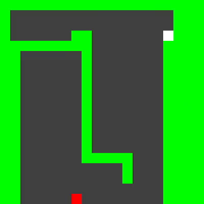

# SnakeAI

You Can play on your own(using WASD) or let ai play it using pathfinding or hamiltonian cycle.
you can use pathfinding with BFS or A* algorithms (i didn't see it winning till now)
or you can use hamiltonian cycle. Everytime you start the game it generates cycle using DFS.

### Algorithms

1. BFS

2. Astar

3. Hamiltonian Cycle

### Resources

[Wikipedia](https://en.wikipedia.org/wiki/Pathfinding)

[CodeBullet](https://www.youtube.com/watch?v=tjQIO1rqTBE)

[AlphaPhoenix](https://www.youtube.com/watch?v=TOpBcfbAgPg)

[JohnTapsell](https://johnflux.com/2015/05/02/nokia-6110-part-3-algorithms/)
